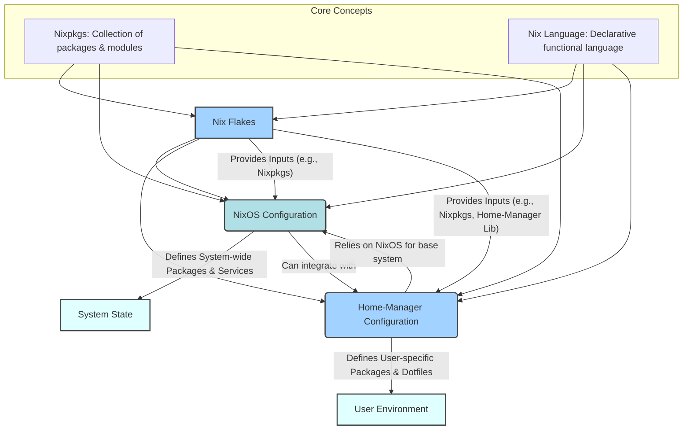

# dotfiles

```mermaid
graph TD
    A[Nix Flakes] --> B(NixOS Configuration);
    A --> C(Home-Manager Configuration);

    B -- Defines System-wide Packages & Services --> B1[System State];
    C -- Defines User-specific Packages & Dotfiles --> C1[User Environment];

    A -- "Provides Inputs (e.g., Nixpkgs)" --> B;
    A -- "Provides Inputs (e.g., Nixpkgs, Home-Manager Lib)" --> C;

    B -- "Can integrate with" --> C;
    C -- "Relies on NixOS for base system" --> B;

    subgraph Core Concepts
        Nixpkgs[Nixpkgs: Collection of packages & modules]
        NixLanguage[Nix Language: Declarative functional language]
    end

    Nixpkgs --> A;
    Nixpkgs --> B;
    Nixpkgs --> C;
    NixLanguage --> A;
    NixLanguage --> B;
    NixLanguage --> C;

    style A fill:#A2D2FF,stroke:#444444,stroke-width:2px
    style B fill:#B0E0E6,stroke:#444444,stroke-width:2px
    style C fill:#A2D2FF,stroke:#444444,stroke-width:2px
    style B1 fill:#E0FFFF,stroke:#444444,stroke-width:2px
    style C1 fill:#E0FFFF,stroke:#444444,stroke-width:2px
```
