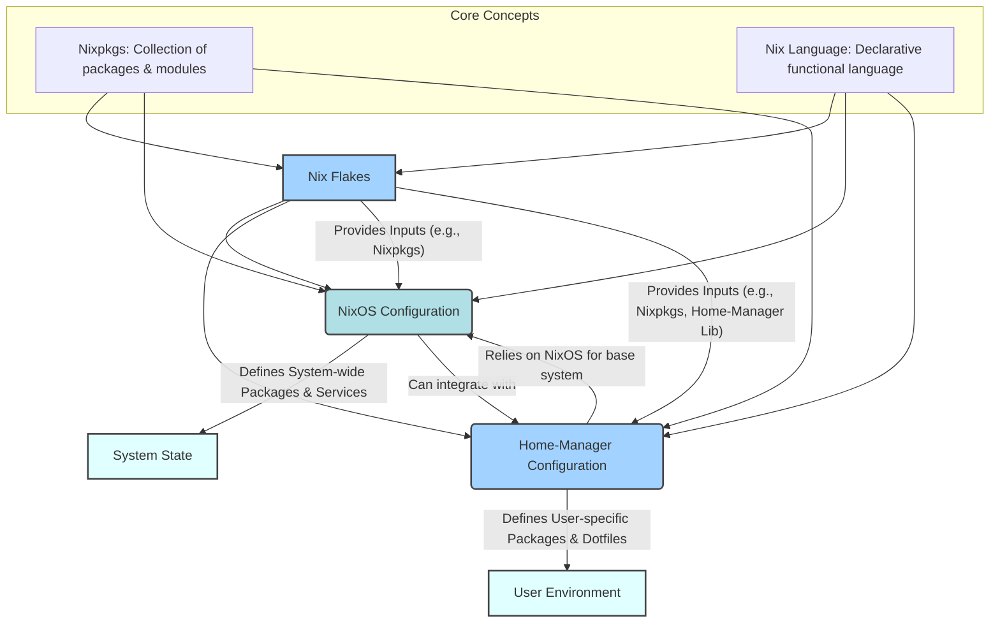

# dotfiles

My NixOS and Home Manager dotfiles configuration for a modern Linux development environment.

## Stack

### Core System
- **OS**: NixOS with Flakes
- **Window Manager**: Hyprland (Wayland compositor)
- **Shell**: Zsh with Zap plugin manager and custom plugins
- **Terminal**: Kitty
- **Theme**: Catppuccin Mocha

### Development Tools
- **Editor**: Neovim with LSP, TreeSitter, and extensive plugin setup
- **Language Servers**: Multiple LSP servers (Rust, TypeScript, Python, Go, etc.)
- **Git**: Git with lazygit and gitui for GUI operations
- **CLI Tools**: bat, eza, fd, ripgrep, fzf

### Applications
- **File Manager**: Thunar
- **PDF Viewer**: Zathura
- **Media**: MPV for video, imv for images
- **Browser**: Firefox, Librewolf, Mullvad Browser
- **Communication**: Discord, Session Desktop
- **Notes**: Obsidian, Joplin Desktop
- **Security**: KeePassXC, Picocrypt, Tor

### Wayland & System
- **Desktop Environment**: Waybar (status bar), Sherlock (app launcher)
- **Screen Lock**: Hyprlock
- **Idle**: Hypridle for power management
- **Screenshots**: Grim + Slurp
- **Color Picker**: Hyprpicker

### Sherlock Launcher Features
Sherlock provides an intelligent application launcher with:
- **App Launcher**: Search and launch applications
- **Weather Widget**: Real-time weather information
- **Clipboard Integration**: Execute clipboard content
- **Spotify Controls**: Audio management and controls
- **Calculator**: Built-in calculator functionality
- **Power Management**: System shutdown, sleep, lock, and reboot
- **VPN Controls**: Wireguard connection management
- **Web Search**: Google and YouTube search integration
- **Utilities**: Color picker and other system tools

## Keybinds

| Keybind | Action |
|---------|--------|
| `Super + Return` | Open terminal |
| `Super + Shift + Return` | Open floating terminal |
| `Super + Shift + Q` | Kill active window |
| `Super + M` | Exit |
| `Super + Shift + Space` | Toggle floating |
| `Super + D` | Open app launcher (Sherlock) |
| `Super + X` | Open power management submenu (Sherlock) |
| `Super + Shift + V` | Open clipboard history |
| `Super + Shift + C` | Color picker |
| `Super + Shift + F` | Open file manager |
| `Super + Shift + B` | Open browser |

### Window Management
| Keybind | Action |
|---------|--------|
| `Super + H/J/K/L` | Focus left/down/up/right |
| `Super + Shift + H/J/K/L` | Move window left/down/up/right |
| `Super + F` | Toggle fullscreen |

### Workspaces
| Keybind | Action |
|---------|--------|
| `Super + 1-9,0` | Switch to workspace 1-10 |
| `Super + Shift + 1-9,0` | Move window to workspace 1-10 |
| `Super + S` | Toggle special workspace |
| `Super + Shift + S` | Move to special workspace |

### System
| Keybind | Action |
|---------|--------|
| `Super + Alt + L` | Lock screen |
| `Alt + Mouse Drag` | Move window |
| `Alt + Shift + Mouse Drag` | Resize window |

### Media Controls
| Keybind | Action |
|---------|--------|
| `XF86AudioRaiseVolume` | Volume up |
| `XF86AudioLowerVolume` | Volume down |
| `XF86AudioMute` | Toggle mute |
| `XF86AudioPlay` | Play/Pause |
| `XF86AudioNext` | Next track |
| `XF86AudioPrev` | Previous track |
| `XF86MonBrightnessUp` | Brightness up |
| `XF86MonBrightnessDown` | Brightness down |

