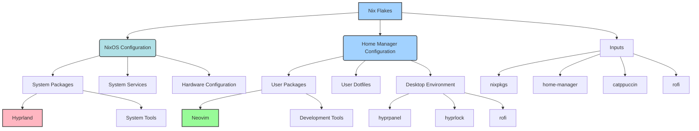

# 🎨 pixel-peeper's dotfiles

> A modern, declarative NixOS and Home Manager configuration for a beautiful and productive Linux development environment

[](https://nixos.org/)
[](https://github.com/nix-community/home-manager)
[](https://hyprland.org/)
[](https://neovim.io/)

## 🧭 System Overview

- **Machine**: `pixel-peeper`
- **OS**: NixOS (flakes enabled)
- **User config**: Home Manager (`homes/pixel-peeper`)
- **Desktop**: Hyprland (Wayland)
- **Shell/Terminal**: Zsh + Kitty
- **Theme**: Catppuccin Mocha across desktop, terminal, and apps
- **Browsers**: Firefox (system), Zen Browser profile, Chromium configs available
- **Editors**: Neovim (LSP, Treesitter, Copilot)
- **File Manager**: Thunar (with trash, archive, and thumbnails)
- **Media**: MPV, Zathura, imv, rmpc/MPD stack
- **Services enabled**: NetworkManager, UPower, power-profiles-daemon, OpenSSH, Printing, D-Bus, Blueman, X11 compatibility, mpdris2, network-manager-applet, poweralertd

### Hyprland stack
- **Core**: `hyprland`, `hyprpanel`, `hyprpaper`, `hyprpicker`, `hypridle`, `hyprlock`, `hyprshot`, `hyprsunset`, `hyprutils`, `hyprcursor`
- **Wayland utils**: `wl-clipboard`, `wl-clip-persist`, `grim`, `slurp`, `grimblast`, `cliphist`, `wl-color-picker`

### Terminal & CLI
- **Shell**: Zsh (Zap), vi-mode, rich keybindings, autosuggestions, completion, Catppuccin prompt
- **Essentials**: `bat`, `eza`, `fd`, `ripgrep`, `fzf`, `tmux`, `yazi`, `atuin`, `zoxide`, `macchina`, `fastfetch`, `tree`, `tldr`
- **Git TUI**: `lazygit`, `gitui`, `tig`, `git-interactive-rebase-tool`

### Development toolchain
- **Languages/Build**: `gcc`, `gnumake`, `cmake`, `ninja`, `meson`, `pkg-config`, `nodejs`, `yarn`, `pnpm`, `go`, `cargo`, `pipx`
- **LSPs**: `nixd`, `pyright`, `rust-analyzer`, `gopls`, `clang-tools`, `typescript-language-server`, `yaml-language-server`, `lua-language-server`, `vscode-langservers-extracted`, `emmet-ls`, `tailwindcss-language-server`, `bash-language-server`, `svelte-language-server`, `typos-lsp`, `harper`
- **Formatters/Linters**: `nixfmt`, `prettier`, `prettierd`, `black`, `stylua`, `rustfmt`, `shellcheck`, `shfmt`, `hadolint`, `yamllint`, `eslint_d`, `pylint`

### Containers, Cloud, and Infra
- **Containers/K8s**: `docker`, `docker-compose`, `buildah`, `skopeo`, `crane`, `helm`, `kustomize`, `minikube`, `kind`, `k3s`, `k9s`
- **Infra as Code**: `terraform`, `terragrunt`, `terraform-ls`, `pulumi`, `ansible`, `ansible-lint`
- **Cloud CLIs**: `awscli2`, `azure-cli`, `google-cloud-sdk`, `doctl`, `linode-cli`, `vultr-cli`, `amazon-ecs-cli`, `acr-cli`
- **Observability**: `prometheus`, `grafana`, `loki`, `promtail`, `node-exporter`, `cadvisor`, `elasticsearch`, `tuistash`

### Security & Networking
- **Networking**: `nmap`, `tcpdump`, `wireshark-cli`, `netcat`, `openssl`, `bandwhich`, `speedtest-cli`
- **Security**: `trivy`, `grype`, `syft`, `semgrep`, `bandit`, `pip-audit`, `vault`, `sops`, `age`, `gopass`, `keychain`
- **Recon**: `nuclei`, `subfinder`, `amass`, `assetfinder`, `waybackurls`, `gau`, `ffuf`, `gobuster`, `dirb`, `nikto`

### Files, Media, and Apps
- **File management**: Thunar + archive plugin + volman + tumbler, `papirus-folders`
- **Media**: `mpv`, `vlc`, `ffmpeg`, `yt-dlp`, `spotdl`, `cava`, `playerctl`, `pavucontrol`, `pamixer`
- **Documents**: `zathura`, `pandoc`, `poppler`, `resvg`, `imagemagick`
- **MPD stack**: `mpd`, `rmpc`, `kew`, `mpdris2`
- **Productivity/Comms**: `obsidian`, `joplin-desktop`, `notesnook`, `syncthing`, `taskwarrior3`, `session-desktop`, `simplex-chat-desktop`, `vesktop`, `spotify`
- **Browsers**: Firefox enabled system-wide; Zen Browser profile via Home Manager; Chromium configs available

Full package catalog is defined in `configs/desktop/hyprland/core/pkgs.nix`.

## ✨ Features

### 🖥️ **Desktop Environment**
- **Hyprland** - Modern Wayland compositor with smooth animations
- **Catppuccin Mocha** - Beautiful, pastel color scheme
- **Hyprpanel** - Elegant status bar with system information
- **Rofi** - Modern application launcher with Catppuccin theme
- **Hyprlock** - Secure lock screen with custom avatar

### 🛠️ **Development Tools**
- **Neovim** - Modern Vim with LSP, TreeSitter, GitHub Copilot, and extensive plugins
- **Kitty** - GPU-accelerated terminal emulator
- **Zsh** - Powerful shell with Zap plugin manager
- **Git** - Version control with lazygit and gitui GUIs
- **jq** - JSON processor for API interactions

### 🎯 **Productivity**
- **Smart Keybindings** - Intuitive window management and navigation
- **Clipboard Integration** - Seamless clipboard history and management
- **Media Controls** - Hardware key support for audio and brightness
- **Screenshot Tools** - Grim + Slurp for area and full-screen captures

## 🚀 Quick Start

### Prerequisites
- NixOS with flakes enabled
- Git

### Installation

1. **Clone the repository:**
   ```bash
   git clone https://github.com/pix3l-p33p3r/dotfiles.git
   cd dotfiles
   ```

2. **Build and switch to the configuration:**
   ```bash
   # For NixOS systems
   sudo nixos-rebuild switch --flake .#pixel-peeper
   
   # For Home Manager only
   home-manager switch --flake .#pixel-peeper@pixel-peeper
   ```

3. **Clean up old generations (optional):**
   ```bash
   ./scripts/nix-cleaner.sh
   ```

## 📁 Project Structure

```
dotfiles/
├── 📄 flake.nix                    # Main flake configuration
├── 🔒 flake.lock                   # Locked dependencies
├── 📖 README.md                    # This documentation
├── ⚖️ LICENSE                      # MIT License
├── 📁 configs/                     # Configuration modules
│   ├── 🖥️ desktop/hyprland/        # Desktop environment
│   │   ├── ⚙️ core/                # Core configurations
│   │   │   ├── hyprland.nix        # Main Hyprland config
│   │   │   ├── settings.nix        # Window manager settings
│   │   │   ├── keybindings.nix     # Key bindings
│   │   │   ├── variables.nix       # Environment variables
│   │   │   ├── theming.nix         # Theme configuration
│   │   │   └── pkgs.nix            # Package definitions
│   │   └── 📱 apps/                # Desktop applications
│   │       ├── applets/            # Status bar, launcher, etc.
│   │       ├── battop.nix          # System monitor
│   │       └── imv.nix             # Image viewer
│   ├── 💻 terminal/                # Terminal configurations
│   │   ├── kitty.nix               # Terminal emulator
│   │   ├── zsh/                    # Shell configuration
│   │   └── nvim/                   # Neovim setup
│   ├── 🌐 browsers/                # Web browsers
│   │   ├── firefox.nix             # Firefox configuration
│   │   └── chromium.nix            # Chromium configuration
│   └── 🎵 media/                   # Media applications
│       ├── mpv.nix                 # Video player
│       ├── zathura.nix             # PDF viewer
│       └── rmpc.nix                # MPD client config, theme, hooks
├── 🎨 assets/                      # Static assets
│   ├── wallpapers/                 # Desktop wallpapers
│   └── avatar/                     # User avatars
├── 👤 homes/                       # User configurations
│   └── pixel-peeper/               # Main user config
├── 🖥️ machines/                    # Machine configurations
│   └── pixel-peeper/               # Main machine config
└── 🔧 scripts/                     # Utility scripts
    └── nix-cleaner.sh              # Cleanup script
```

## 🎮 Keybindings

### 🪟 **Window Management**
| Keybind | Action |
|---------|--------|
| `Super + Return` | Open terminal |
| `Super + Shift + Return` | Open floating terminal |
| `Super + Q` | Kill active window |
| `Super + M` | Exit Hyprland |
| `Super + Shift + Space` | Toggle floating |
| `Super + Shift + F` | Toggle fullscreen |

### 🧭 **Navigation**
| Keybind | Action |
|---------|--------|
| `Super + H/J/K/L` | Focus left/down/up/right |
| `Super + Shift + H/J/K/L` | Move window left/down/up/right |
| `Super + 1-9,0` | Switch to workspace 1-10 |
| `Super + Shift + 1-9,0` | Move window to workspace 1-10 |
| `Super + S` | Toggle special workspace |

### 🚀 **Applications**
| Keybind | Action |
|---------|--------|
| `Super + D` | Open app launcher (Rofi) |
| `Super + Shift + D` | Open run dialog (Rofi) |
| `Super + Shift + V` | Open clipboard history |
| `Super + Shift + C` | Color picker |
| `Super + F` | Open file manager |
| `Super + B` | Open browser |

### 🔒 **System**
| Keybind | Action |
|---------|--------|
| `Super + Escape` | Lock screen |
| `Alt + Mouse Drag` | Move window |
| `Alt + Shift + Mouse Drag` | Resize window |

### 🎵 **Media Controls**
| Keybind | Action |
|---------|--------|
| `XF86AudioRaiseVolume` | Volume up |
| `XF86AudioLowerVolume` | Volume down |
| `XF86AudioMute` | Toggle mute |
| `XF86AudioPlay` | Play/Pause |
| `XF86AudioNext` | Next track |
| `XF86AudioPrev` | Previous track |
| `XF86MonBrightnessUp` | Brightness up |
| `XF86MonBrightnessDown` | Brightness down |

## 🛠️ Technology Stack

### 🏗️ **Core System**
- **OS**: NixOS with Flakes
- **Window Manager**: Hyprland (Wayland compositor)
- **Shell**: Zsh with Zap plugin manager
- **Terminal**: Kitty
- **Theme**: Catppuccin Mocha

### 💻 **Development**
- **Editor**: Neovim with LSP, TreeSitter, GitHub Copilot, and 40+ plugins
- **AI Assistant**: GitHub Copilot for intelligent code completion
- **Language Servers**: Rust, TypeScript, Python, Go, Lua, and more
- **Git**: lazygit, gitui for GUI operations
- **CLI Tools**: bat, eza, fd, ripgrep, fzf, jq
- **Package Manager**: Nix with Home Manager

### 🧩 System Modules
- `machines/pixel-peeper` — NixOS machine: core system (`system.nix`), services, hardware, security, wayland/x11, programs
- `homes/pixel-peeper` — Home Manager: desktop imports, theme, portals, zsh, zen-browser
- `configs/desktop/hyprland` — Desktop: core settings, keybindings, theming, services, applets (panel, lock, idle, rofi, paper)
- `configs/terminal/zsh` — Zsh: Zap-based shell, aliases, keymaps, functions, completions, prompt
- `configs/terminal/nvim` — Neovim: Lazy.nvim, plugins, LSP, options, keymaps
- `configs/media` — MPV, Zathura, rmpc configuration
- `configs/browsers` — Firefox and Chromium modules

## 📦 Packages Catalog

Source of truth: `configs/desktop/hyprland/core/pkgs.nix` (Home Manager `home.packages`). Below is an organized catalog of what’s included on this system.

| Category | Highlights (not exhaustive) |
|---|---|
| Core Utilities | curl, jq, wget, xdg-utils |
| Development Tools | git, git-lfs, gh, glab, cmake, ninja, meson, pkg-config |
| Package Managers | cargo, go, nodejs, yarn, pnpm, pipx |
| Lint/Format | shellcheck, shfmt, hadolint, yamllint, prettier, prettierd, black, stylua, rustfmt, nixfmt |
| Language Servers | nixd, pyright, rust-analyzer, gopls, clang-tools, typescript-language-server, yaml-language-server, lua-language-server, vscode-langservers-extracted, emmet-ls, svelte-language-server, tailwindcss-language-server, bash-language-server, typos-lsp, harper |
| Dev Utilities | ripgrep, fd, tree-sitter, inotify-tools, gnumake |
| Containers | docker, docker-compose, buildah, skopeo, crane |
| Kubernetes | helm, kustomize, minikube, kind, k3s, k9s, stern |
| IaC | terraform, terragrunt, terraform-ls, pulumi, ansible, ansible-lint |
| Cloud CLIs | awscli2, azure-cli, google-cloud-sdk, amazon-ecs-cli, acr-cli, doctl, linode-cli, vultr-cli |
| Observability | prometheus, grafana, loki, promtail, prometheus-node-exporter, cadvisor, elasticsearch, tuistash |
| Security | trivy, grype, syft, semgrep, bandit, pip-audit, vault, sops, age, gopass, pass, keychain |
| Recon | nuclei, subfinder, amass, assetfinder, waybackurls, gau, ffuf, gobuster, dirb, nikto |
| Embedded/Hardware | gcc-arm-embedded, openocd, qemu, avrdude, picocom, minicom, sigrok-cli, pulseview, gtkwave, iverilog |
| System/Perf | iotop, vnstat, perf, strace, ltrace, btop, s-tui, procps, memtest86plus, stress-ng |
| Filesystems | ntfs3g, exfat, f2fs-tools, xfsprogs, btrfs-progs, e2fsprogs |
| HW/Power | acpi, brightnessctl, dysk, gvfs, kmon, libgtop, nvtopPackages.intel, power-profiles-daemon, upower |
| Terminal Apps | atuin, bat, eza, fastfetch, fzf, glow, gping, macchina, nix-tree, tldr, tmux, trashy, tree, tt, ueberzugpp, yazi, zoxide |
| Git TUIs | tig, git-interactive-rebase-tool, gitui, lazygit |
| Docker/Dev TUIs | lazydocker, lazysql, lazyjournal, lazyhetzner |
| Networking TUIs | bandwhich, slurm, speedtest-cli |
| DB CLIs | mycli, pgcli, litecli, usql |
| Hyprland Stack | hyprland, hyprpanel, hyprpaper, hyprpicker, hypridle, hyprlock, hyprshot, hyprsunset, hyprutils, hyprcursor |
| Wayland Utils | cliphist, grim, grimblast, slurp, wl-clipboard, wl-clip-persist, wl-color-picker |
| Audio | alsa-firmware, alsa-tools, cava, pamixer, pavucontrol, pipewire, playerctl, wireplumber |
| Networking | bluez, bluez-tools, networkmanager, networkmanagerapplet, wifi-qr |
| File Management | xfce.thunar, xfce.thunar-archive-plugin, xfce.thunar-volman, xfce.tumbler, papirus-folders |
| Media & Docs | ffmpeg, yt-dlp, spotdl, imagemagick, imv, mpv, vlc, zathura, pandoc, poppler, resvg |
| MPD Stack | mpd, rmpc, kew, mpdris2 |
| GUI Apps | code-cursor, cursor-cli, qutebrowser, librewolf, mullvad-browser, joplin-desktop, notesnook, obsidian, onionshare-gui, tor, gpa, keepassxc, picocrypt, session-desktop, simplex-chat-desktop, vesktop, hackgregator, puffin, spotify, syncthing, taskwarrior3 |
| AI | gemini-cli, fabric-ai |
| Dev Libraries | dart-sass, gtksourceview3, libsoup_3 |
| Drivers | intel-gpu-tools, vulkan-tools |

Tip: open `pkgs.nix` to view the full, categorized list and adjust as needed.

### 🎨 **Applications**
- **File Manager**: Thunar
- **PDF Viewer**: Zathura
- **Media**: MPV (video), imv (images)
- **Browsers**: Firefox, Chromium
- **Communication**: Discord, Session Desktop
- **Notes**: Obsidian, Joplin Desktop
- **Security**: KeePassXC, Picocrypt

### 🔧 **System Tools**
- **Status Bar**: hyprpanel
- **App Launcher**: Rofi with Catppuccin theme and plugins
- **Screen Lock**: hyprlock with custom avatar
- **Idle Management**: hypridle
- **Screenshots**: Grim + Slurp
- **Color Picker**: hyprpicker

## 🎯 Rofi Launcher Features

Rofi provides a powerful application launcher with Catppuccin Mocha theming:

- **🔍 App Launcher**: Search and launch applications with fuzzy matching
- **🎨 Catppuccin Theme**: Beautiful Mocha color scheme integration
- **📱 Multiple Modes**: Applications, run commands, window switcher, SSH
- **🧮 Calculator**: Built-in calculator with rofi-calc plugin
- **😀 Emoji Picker**: Quick emoji insertion with rofi-emoji plugin
- **⚡ Power Menu**: System management with rofi-power-menu plugin
- **⌨️ Keyboard Navigation**: Full keyboard support with intuitive shortcuts
- **🎭 Smooth Animations**: Elegant transitions and visual effects
- **🔧 Extensible**: Plugin system for additional functionality

## 🎨 Customization

### 🖼️ **Wallpapers**
Place your wallpapers in `assets/wallpapers/` and update the path in `flake.nix`:
```nix
wallpaper = self + "/assets/wallpapers/your-wallpaper.jpg";
```

### 👤 **Avatar**
Replace `assets/avatar/ryuma_pixel-peeper.png` with your own avatar for the lock screen.

### 🎨 **Theme**
The configuration uses Catppuccin Mocha across all applications. Comprehensive theme integration includes:
- **Terminal**: Kitty, Tmux, Yazi
- **Development**: LazyGit, GitUI
- **Media**: MPV, IMV, Zathura, Cava
- **System**: Btop, Bat, Eza, FZF
- **Launcher**: Rofi with Catppuccin module
- **Editor**: Neovim with Catppuccin colorscheme

To change themes, modify `homes/pixel-peeper/catppuccin.nix`.

### ⌨️ **Keybindings**
Customize keybindings in `configs/desktop/hyprland/core/keybindings.nix`.

## 🔧 Maintenance

### 🧹 **Cleanup**
```bash
# Clean old generations and free space
./scripts/nix-cleaner.sh

# Or use the alias
clean
```

### 🔄 **Update**
```bash
# Update flake inputs
nix flake update

# Rebuild system
build
```

### 🐛 **Troubleshooting**
```bash
# Check configuration
nix flake check

# Build without switching
nix build .#nixosConfigurations.pixel-peeper.config.system.build.toplevel

# Rollback to previous generation
sudo nixos-rebuild switch --rollback
```

## 📊 System Architecture



## 🤝 Contributing

1. Fork the repository
2. Create a feature branch (`git checkout -b feature/amazing-feature`)
3. Commit your changes (`git commit -m 'Add amazing feature'`)
4. Push to the branch (`git push origin feature/amazing-feature`)
5. Open a Pull Request

## 📄 License

This project is licensed under the MIT License - see the [LICENSE](LICENSE) file for details.

## 🙏 Acknowledgments

- [NixOS](https://nixos.org/) - The purely functional Linux distribution
- [Home Manager](https://github.com/nix-community/home-manager) - Manage a user environment using Nix
- [Hyprland](https://hyprland.org/) - Dynamic tiling Wayland compositor
- [Catppuccin](https://github.com/catppuccin/catppuccin) - Soothing pastel theme
- [Rofi](https://github.com/davatorium/rofi) - Application launcher and dmenu replacement
- [Neovim](https://neovim.io/) - Hyperextensible Vim-based text editor

---

<div align="center">

**⭐ Star this repository if you found it helpful!**

Made with ❤️ by [me](https://pixel-peeper.me)

</div>