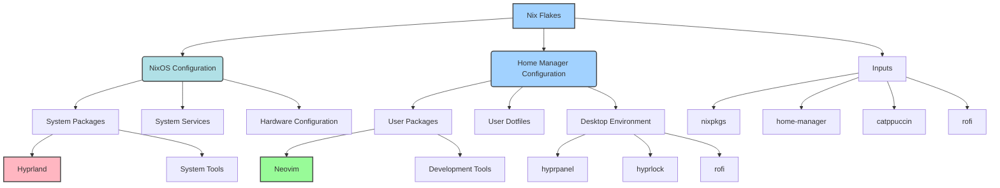

# 🎨 pixel-peeper's dotfiles

> A modern, declarative NixOS and Home Manager configuration for a beautiful and productive Linux development environment

[](https://nixos.org/)
[](https://github.com/nix-community/home-manager)
[](https://hyprland.org/)
[](https://neovim.io/)

## ✨ Features

### 🖥️ **Desktop Environment**
- **Hyprland** - Modern Wayland compositor with smooth animations
- **Catppuccin Mocha** - Beautiful, pastel color scheme
- **Hyprpanel** - Elegant status bar with system information
- **Rofi** - Modern application launcher with Catppuccin theme
- **Hyprlock** - Secure lock screen with custom avatar

### 🛠️ **Development Tools**
- **Neovim** - Modern Vim with LSP, TreeSitter, GitHub Copilot, and extensive plugins
- **Kitty** - GPU-accelerated terminal emulator
- **Zsh** - Powerful shell with Zap plugin manager
- **Git** - Version control with lazygit and gitui GUIs
- **jq** - JSON processor for API interactions

### 🎯 **Productivity**
- **Smart Keybindings** - Intuitive window management and navigation
- **Clipboard Integration** - Seamless clipboard history and management
- **Media Controls** - Hardware key support for audio and brightness
- **Screenshot Tools** - Grim + Slurp for area and full-screen captures

## 🚀 Quick Start

### Prerequisites
- NixOS with flakes enabled
- Git

### Installation

1. **Clone the repository:**
   ```bash
   git clone https://github.com/pix3l-p33p3r/dotfiles.git
   cd dotfiles
   ```

2. **Build and switch to the configuration:**
   ```bash
   # For NixOS systems
   sudo nixos-rebuild switch --flake .#pixel-peeper
   
   # For Home Manager only
   home-manager switch --flake .#pixel-peeper@pixel-peeper
   ```

3. **Clean up old generations (optional):**
   ```bash
   ./scripts/nix-cleaner.sh
   ```

## 📁 Project Structure

```
dotfiles/
├── 📄 flake.nix                    # Main flake configuration
├── 🔒 flake.lock                   # Locked dependencies
├── 📖 README.md                    # This documentation
├── ⚖️ LICENSE                      # MIT License
├── 📁 configs/                     # Configuration modules
│   ├── 🖥️ desktop/hyprland/        # Desktop environment
│   │   ├── ⚙️ core/                # Core configurations
│   │   │   ├── hyprland.nix        # Main Hyprland config
│   │   │   ├── settings.nix        # Window manager settings
│   │   │   ├── keybindings.nix     # Key bindings
│   │   │   ├── variables.nix       # Environment variables
│   │   │   ├── theming.nix         # Theme configuration
│   │   │   └── pkgs.nix            # Package definitions
│   │   └── 📱 apps/                # Desktop applications
│   │       ├── applets/            # Status bar, launcher, etc.
│   │       ├── battop.nix          # System monitor
│   │       └── imv.nix             # Image viewer
│   ├── 💻 terminal/                # Terminal configurations
│   │   ├── kitty.nix               # Terminal emulator
│   │   ├── zsh/                    # Shell configuration
│   │   └── nvim/                   # Neovim setup
│   ├── 🌐 browsers/                # Web browsers
│   │   ├── firefox.nix             # Firefox configuration
│   │   └── chromium.nix            # Chromium configuration
│   └── 🎵 media/                   # Media applications
│       ├── mpv.nix                 # Video player
│       ├── zathura.nix             # PDF viewer
│       └── rmpc.nix                # MPD client config, theme, hooks
├── 🎨 assets/                      # Static assets
│   ├── wallpapers/                 # Desktop wallpapers
│   └── avatar/                     # User avatars
├── 👤 homes/                       # User configurations
│   └── pixel-peeper/               # Main user config
├── 🖥️ machines/                    # Machine configurations
│   └── pixel-peeper/               # Main machine config
└── 🔧 scripts/                     # Utility scripts
    └── nix-cleaner.sh              # Cleanup script
```

## 🎮 Keybindings

### 🪟 **Window Management**
| Keybind | Action |
|---------|--------|
| `Super + Return` | Open terminal |
| `Super + Shift + Return` | Open floating terminal |
| `Super + Q` | Kill active window |
| `Super + M` | Exit Hyprland |
| `Super + Shift + Space` | Toggle floating |
| `Super + Shift + F` | Toggle fullscreen |

### 🧭 **Navigation**
| Keybind | Action |
|---------|--------|
| `Super + H/J/K/L` | Focus left/down/up/right |
| `Super + Shift + H/J/K/L` | Move window left/down/up/right |
| `Super + 1-9,0` | Switch to workspace 1-10 |
| `Super + Shift + 1-9,0` | Move window to workspace 1-10 |
| `Super + S` | Toggle special workspace |

### 🚀 **Applications**
| Keybind | Action |
|---------|--------|
| `Super + D` | Open app launcher (Rofi) |
| `Super + Shift + D` | Open run dialog (Rofi) |
| `Super + Shift + V` | Open clipboard history |
| `Super + Shift + C` | Color picker |
| `Super + F` | Open file manager |
| `Super + B` | Open browser |

### 🔒 **System**
| Keybind | Action |
|---------|--------|
| `Super + Escape` | Lock screen |
| `Alt + Mouse Drag` | Move window |
| `Alt + Shift + Mouse Drag` | Resize window |

### 🎵 **Media Controls**
| Keybind | Action |
|---------|--------|
| `XF86AudioRaiseVolume` | Volume up |
| `XF86AudioLowerVolume` | Volume down |
| `XF86AudioMute` | Toggle mute |
| `XF86AudioPlay` | Play/Pause |
| `XF86AudioNext` | Next track |
| `XF86AudioPrev` | Previous track |
| `XF86MonBrightnessUp` | Brightness up |
| `XF86MonBrightnessDown` | Brightness down |

## 🛠️ Technology Stack

### 🏗️ **Core System**
- **OS**: NixOS with Flakes
- **Window Manager**: Hyprland (Wayland compositor)
- **Shell**: Zsh with Zap plugin manager
- **Terminal**: Kitty
- **Theme**: Catppuccin Mocha

### 💻 **Development**
- **Editor**: Neovim with LSP, TreeSitter, GitHub Copilot, and 40+ plugins
- **AI Assistant**: GitHub Copilot for intelligent code completion
- **Language Servers**: Rust, TypeScript, Python, Go, Lua, and more
- **Git**: lazygit, gitui for GUI operations
- **CLI Tools**: bat, eza, fd, ripgrep, fzf, jq
- **Package Manager**: Nix with Home Manager

### 🎨 **Applications**
- **File Manager**: Thunar
- **PDF Viewer**: Zathura
- **Media**: MPV (video), imv (images)
- **Browsers**: Firefox, Chromium
- **Communication**: Discord, Session Desktop
- **Notes**: Obsidian, Joplin Desktop
- **Security**: KeePassXC, Picocrypt

### 🔧 **System Tools**
- **Status Bar**: hyprpanel
- **App Launcher**: Rofi with Catppuccin theme and plugins
- **Screen Lock**: hyprlock with custom avatar
- **Idle Management**: hypridle
- **Screenshots**: Grim + Slurp
- **Color Picker**: hyprpicker

## 🎯 Rofi Launcher Features

Rofi provides a powerful application launcher with Catppuccin Mocha theming:

- **🔍 App Launcher**: Search and launch applications with fuzzy matching
- **🎨 Catppuccin Theme**: Beautiful Mocha color scheme integration
- **📱 Multiple Modes**: Applications, run commands, window switcher, SSH
- **🧮 Calculator**: Built-in calculator with rofi-calc plugin
- **😀 Emoji Picker**: Quick emoji insertion with rofi-emoji plugin
- **⚡ Power Menu**: System management with rofi-power-menu plugin
- **⌨️ Keyboard Navigation**: Full keyboard support with intuitive shortcuts
- **🎭 Smooth Animations**: Elegant transitions and visual effects
- **🔧 Extensible**: Plugin system for additional functionality

## 🎨 Customization

### 🖼️ **Wallpapers**
Place your wallpapers in `assets/wallpapers/` and update the path in `flake.nix`:
```nix
wallpaper = self + "/assets/wallpapers/your-wallpaper.jpg";
```

### 👤 **Avatar**
Replace `assets/avatar/ryuma_pixel-peeper.png` with your own avatar for the lock screen.

### 🎨 **Theme**
The configuration uses Catppuccin Mocha across all applications. Comprehensive theme integration includes:
- **Terminal**: Kitty, Tmux, Yazi
- **Development**: LazyGit, GitUI
- **Media**: MPV, IMV, Zathura, Cava
- **System**: Btop, Bat, Eza, FZF
- **Launcher**: Rofi with Catppuccin module
- **Editor**: Neovim with Catppuccin colorscheme

To change themes, modify `homes/pixel-peeper/catppuccin.nix`.

### ⌨️ **Keybindings**
Customize keybindings in `configs/desktop/hyprland/core/keybindings.nix`.

## 🔧 Maintenance

### 🧹 **Cleanup**
```bash
# Clean old generations and free space
./scripts/nix-cleaner.sh

# Or use the alias
clean
```

### 🔄 **Update**
```bash
# Update flake inputs
nix flake update

# Rebuild system
build
```

### 🐛 **Troubleshooting**
```bash
# Check configuration
nix flake check

# Build without switching
nix build .#nixosConfigurations.pixel-peeper.config.system.build.toplevel

# Rollback to previous generation
sudo nixos-rebuild switch --rollback
```

## 📊 System Architecture



## 🤝 Contributing

1. Fork the repository
2. Create a feature branch (`git checkout -b feature/amazing-feature`)
3. Commit your changes (`git commit -m 'Add amazing feature'`)
4. Push to the branch (`git push origin feature/amazing-feature`)
5. Open a Pull Request

## 📄 License

This project is licensed under the MIT License - see the [LICENSE](LICENSE) file for details.

## 🙏 Acknowledgments

- [NixOS](https://nixos.org/) - The purely functional Linux distribution
- [Home Manager](https://github.com/nix-community/home-manager) - Manage a user environment using Nix
- [Hyprland](https://hyprland.org/) - Dynamic tiling Wayland compositor
- [Catppuccin](https://github.com/catppuccin/catppuccin) - Soothing pastel theme
- [Rofi](https://github.com/davatorium/rofi) - Application launcher and dmenu replacement
- [Neovim](https://neovim.io/) - Hyperextensible Vim-based text editor

---

<div align="center">

**⭐ Star this repository if you found it helpful!**

Made with ❤️ by [me](https://pixel-peeper.me)

</div>

## 📝 Last Updated

- Date: 2025-10-31
- Changes:
  - Updated `configs/terminal/zsh/config/conf.d/102-aliases.zsh`
  - Updated `machines/pixel-peeper/system.nix`