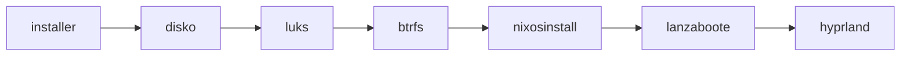

# alucard

Lean NixOS flake. Disko + LUKS + btrfs, Home Manager as a NixOS module, Lanzaboote, Plymouth, Hyprland + Wayle.

## Layout

```
flake.nix
disko/alucard.nix          # GPT + LUKS + btrfs subvols
hosts/alucard/             # machine
modules/                   # boot, nix, desktop, home, secrets stub
homes/pixel-peeper.nix     # HM user
secrets/                   # Elliot / sops-nix
assets/wallpapers/
```

## First install (wipes the disk)

1. Confirm the disk: `lsblk`. Edit `disko/alucard.nix` `device` if it is not `/dev/nvme0n1`.
2. From a NixOS installer:

```sh
sudo nix --extra-experimental-features 'nix-command flakes' run github:nix-community/disko -- --mode disko --flake .#alucard
sudo nixos-install --flake .#alucard
```

3. After first boot: `sbctl status`, enroll Lanzaboote keys, `systemd-cryptenroll --tpm2-device=auto /dev/nvme0n1p2` if you want TPM unlock.
4. `nix flake lock` if you cloned without a lockfile.

## Rebuild

```sh
sudo nixos-rebuild switch --flake .#alucard
```

## What this is

Not the old tree. No stylix, winapps, waydroid, NUR, zen, hyprpanel, clamav, aide, lynis, i2p, tor, or standalone HM. Browsers: Firefox, Chrome, Mullvad. Bar: Wayle. Swap: zram.

## Pipeline


```mermaid
flowchart LR
  installer --> disko
  disko --> luks
  luks --> btrfs
  btrfs --> nixosinstall
  nixosinstall --> lanzaboote
  lanzaboote --> hyprland
```
